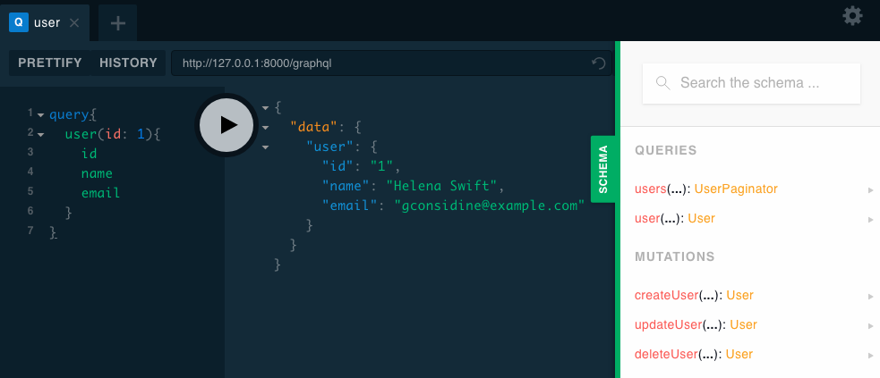

# 入门

这是一份使用 Lighthouse 构建 GraphQL 服务器的入门教程。
虽然我们试图保持初学者的友好，但我们建议您熟悉一下 [GraphQL](https://graphql.org/) 和 [Laravel](https://laravel.com/).

## GraphQL 是什么?

GraphQL 是一种用于 API 的查询语言，是一个使用基于类型系统来执行查询的服务端运行时（类型系统由你的数据定义）。

GraphQL 为你的 API 提供了一个完整易懂的数据描述，给予客户去指定他们所需要的数据的权利，仅此而已，随着时间的推移，使 API 更容易演化，并支持强大的开发人员工具。

<div align="center">
    
  <small>GraphQL Playground</small>
</div>

GraphQL 目前只是发布了一个 [*规范*](https://facebook.github.io/graphql/).
这意味着 GraphQL 实际上只是一个详细描述 GraphQL 服务器的行为的内容。

GraphQL 有自己的类型系统，用于定义 API 的模式。
编写模式的语法称为[模式定义语言](https://www.prisma.io/blog/graphql-sdl-schema-definition-language-6755bcb9ce51/) 或简称 **SDL**.

在下面的一个示例，我们使用 SDL 来定义一个名为 `User` 的类型及其与另一个类型 `Post` 的关系。

```graphql
type User {
  id: ID!
  name: String!
  posts: [Post!]!
}

type Post {
  title: String!
  author: User!
}
```

注意，我们只是在 `User` 和 `Post` 之间创建了一对多的关系。
`User` 类型有一个字段 `posts`，它返回 `Post` 类型的列表。

我们还通过 `author` 字段定义了从 `Post` 到 `User` 的反向关系。

## Lighthouse 是什么?

Lighthouse 可以让任何 Laravel 项目，轻松地提供自己的 GraphQL 服务器。

使用 Lighthouse 构建 GraphQL 服务器的过程可以分为三个步骤:

1. 使用 GraphQL 模式定义语言定义数据的结构
1. 使用 Lighthouses 预先构建的指令来实现您的模式
1. 在需要使用 GraphQL 功能的地方使用扩展 Lighthouse

<div align="center">
    
  <small>GraphQL 在应用程序中的角色</small>
</div>

## 演示

在这次的演示中，我们将从零开始为一个简单博客创建 GraphQL API:

- Laravel
- Lighthouse
- GraphQL Playground

::: tip
您可以下载本教程的源代码 [https://github.com/nuwave/lighthouse-tutorial](https://github.com/nuwave/lighthouse-tutorial)
:::

## 安装

### 创建一个新的 Laravel 项目

::: tip
本教程从一个全新的 Laravel 项目开始。
您可以使用现有的项目并直接跳到 [安装 Lighthouse](#installing-lighthouse)，
但您可能需要调整一些东西来适应你现有的应用程序。
:::

假设您正在使用 Laravel 安装程序，请创建一个新项目
（阅读更多关于 [安装 Laravel](https://laravel.com/docs/#installing-laravel) 的知识）:

    laravel new lighthouse-tutorial

查看 [关于数据库配置的 Laravel 文档](https://laravel.com/docs/database#configuration)
并确保设置了一个可以使用的数据库。

运行数据库迁移以创建 `users` 表:

    php artisan migrate

在数据库中植入一些假的用户数据:

    php artisan tinker
    factory('App\User', 10)->create();

### 安装 Lighthouse

当然，我们将使用 Lighthouse 作为 GraphQL 服务器。

    composer require nuwave/lighthouse

在演示中我们使用 [GraphQL Playground](https://github.com/prisma-labs/graphql-playground)
作为 GraphQL 查询的 IDE （在线调试工具）。它就好像 GraphQL 专用的 Postman，拥有很多神奇的功能。

    composer require mll-lab/laravel-graphql-playground

然后将默认模式发布到 `graphql/schema.graphql`.

    php artisan vendor:publish --provider="Nuwave\Lighthouse\LighthouseServiceProvider" --tag=schema

为了确保一切正常，访问 Laravel GraphQL Playground ，默认路由是 `/graphql-playground`
并尝试下面的查询:

```graphql
{
  user(id: 1) {
    id
    name
    email
  }
}
```

现在，让我们继续并为我们的博客创建一个 GraphQL API。

## 数据模型

第一部分将向您展示如何设置模型和数据库迁移并且不包括任何与 GraphQL 或 Lighthouse 相关的细节。

我们的博客遵循一些简单的规则:
- 用户可以发布多个 post
- 每个 post 可以有来自匿名用户的多条 comment

我们可以像这样在数据库模式中建立模型。

<div align="center">
    
  <p><small>数据库关系图</small></p>
</div>

首先为我们的 posts 和 comments 定义模型和迁移

    php artisan make:model -m Post

```php
<?php

namespace App;

use Illuminate\Database\Eloquent\Model;
use Illuminate\Database\Eloquent\Relations\HasMany;
use Illuminate\Database\Eloquent\Relations\BelongsTo;

class Post extends Model
{
    public function author(): BelongsTo
    {
        return $this->belongsTo(User::class);
    }

    public function comments(): HasMany
    {
        return $this->hasMany(Comment::class);
    }
}
```

```php
<?php

use Illuminate\Support\Facades\Schema;
use Illuminate\Database\Schema\Blueprint;
use Illuminate\Database\Migrations\Migration;

class CreatePostsTable extends Migration
{
    public function up()
    {
        Schema::create('posts', function (Blueprint $table) {
            $table->increments('id');
            $table->unsignedInteger('author_id');
            $table->string('title');
            $table->string('content');
            $table->timestamps();
        });
    }

    public function down()
    {
        Schema::dropIfExists('posts');
    }
}
```

    php artisan make:model -m Comment

```php
<?php

namespace App;

use Illuminate\Database\Eloquent\Model;
use Illuminate\Database\Eloquent\Relations\BelongsTo;

class Comment extends Model
{
    public function post(): BelongsTo
    {
        return $this->belongsTo(Post::class);
    }
}
```

```php
<?php

use Illuminate\Support\Facades\Schema;
use Illuminate\Database\Schema\Blueprint;
use Illuminate\Database\Migrations\Migration;

class CreateCommentsTable extends Migration
{
    public function up()
    {
        Schema::create('comments', function (Blueprint $table) {
            $table->increments('id');
            $table->unsignedInteger('post_id');
            $table->string('reply');
            $table->timestamps();
        });
    }

    public function down()
    {
        Schema::dropIfExists('comments');
    }
}
```

记得要运行迁移:

    php artisan migrate

最后，将 `posts` 模型添加到 `app/User.php`

```php
<?php

namespace App;

use Illuminate\Notifications\Notifiable;
use Illuminate\Database\Eloquent\Relations\HasMany;
use Illuminate\Foundation\Auth\User as Authenticatable;

class User extends Authenticatable
{
    use Notifiable;

    protected $fillable = [
        'name', 'email', 'password',
    ];

    protected $hidden = [
        'password', 'remember_token',
    ];

    public function posts(): HasMany
    {
        return $this->hasMany(Post::class, 'author_id');
    }
}
```

## 魔术方法 (Magic Methods)

让我们修改 `graphql/schema.graphql` 并根据我们创建的有说服力的模型来定义我们的 posts 的模式。

我们添加了两个用于查询文章到底部的 Query 类型下：

```graphql
type Query {
    posts: [Post!]! @all
    post(id: Int! @eq): Post @find
}
```

Lighthouse 知道如何解决查询的方法是基于约定的命名 — 类型名的组合 `Post` 也是我们模型的名称 — 以及服务器端指令的使用。

- [`@all`](../master/api-reference/directives.md#all) 返回所有内容的列表 `Post` 模型
- [`@find`](../master/api-reference/directives.md#find) 和 [`@eq`](../master/api-reference/directives.md#eq)
  是通过其 ID 组合检索单个 `Post` 

我们还可以通过添加额外的类型定义，明确定义我们的数据模型:

```graphql
type Query {
    posts: [Post!]! @all
    post(id: Int! @eq): Post @find
}

type User {
    id: ID!
    name: String!
    email: String!
    created_at: DateTime!
    updated_at: DateTime!
    posts: [Post!]! @hasMany
}

type Post {
    id: ID!
    title: String!
    content: String!
    author: User! @belongsTo
    comments: [Comment!]! @hasMany
}

type Comment {
    id: ID!
    reply: String!
    post: Post! @belongsTo
}
```

就像在 Eloquent 中一样， 我们通过
[`@belongsTo`](../master/api-reference/directives.md#belongsto) 和 [`@hasMany`](../master/api-reference/directives.md#hasmany) 指令来表达类型之间的关系。

## 最终测试

在你的数据库中插入一些假数据，你可以使用 [Laravel seeders](https://laravel.com/docs/seeding) 来完成。

访问 `/graphql-playground` 并尝试以下的查询：

```graphql
{
  posts {
    id
    title
    author {
      name
    }
    comments {
      id
      reply
    }
  }
}
```

您应该可以获取到数据库中所有 posts 的列表，以及全部 comments 和 user 的 name。

希望这个演示为您展示了 GraphQL 的强大功能，以及 Lighthouse 如何轻松地使用 Laravel 来构建自己的服务器。

## 进一步学习

您的应用程序可能会使用更多的功能，这里有一些关于你可以了解什么来掌握更多关于 Lighthouse 的使用。

- [在字段中添加分页](../master/api-reference/directives.md#paginate)
- [创建和更新更加健壮的模型](../master/eloquent/getting-started.md#create)
- [验证发送到服务器的输入](../master/security/validation.md)
